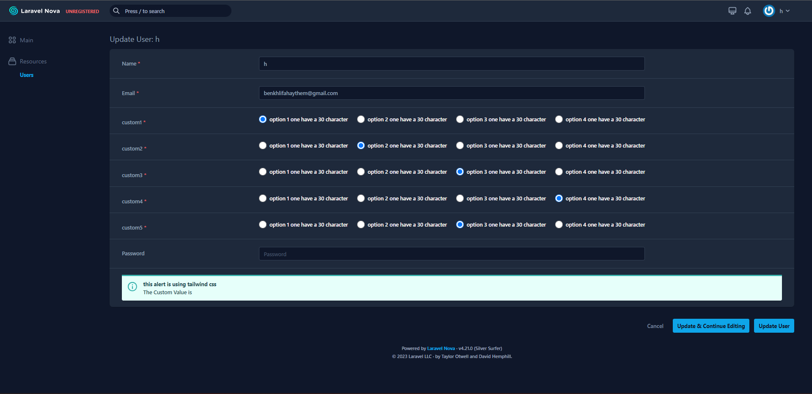
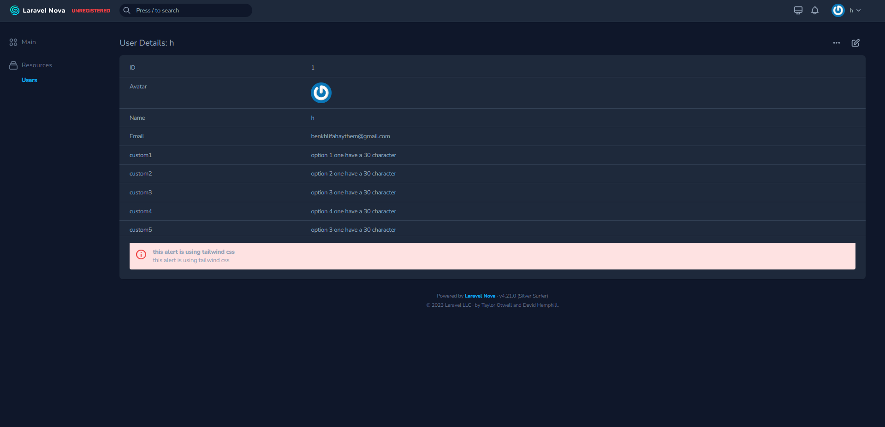
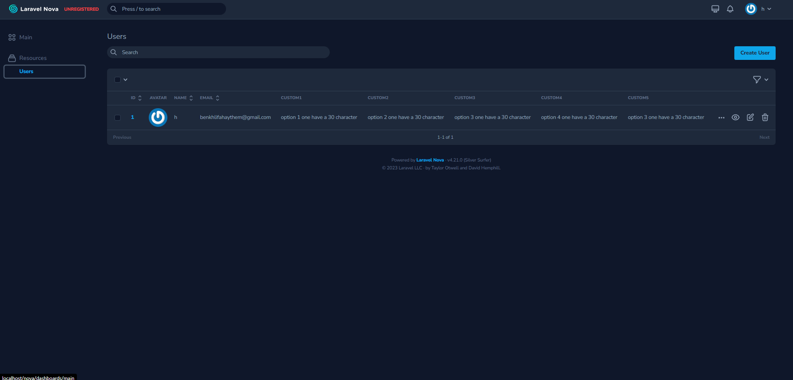

# RadioSlider

### Installation

composer require haythem/radio-slider

## Usage

```php
        // NOVA RESOURCE
        use Haythembenkhlifa\RadioSlider\RadioSlider;

        public function fields(Request $request)
        {

              return [
                        RadioSlider::make("Marks Slider", "custom_field")
                            ->setValues(['Not Likely' => 0, 'Maybe' => 'maybe', 'Very likely' => 'very likely'])
                            ->initialValue(4)//this will select the default value if there is nothing on the database.
              ];
        }


```

## Screenshot






